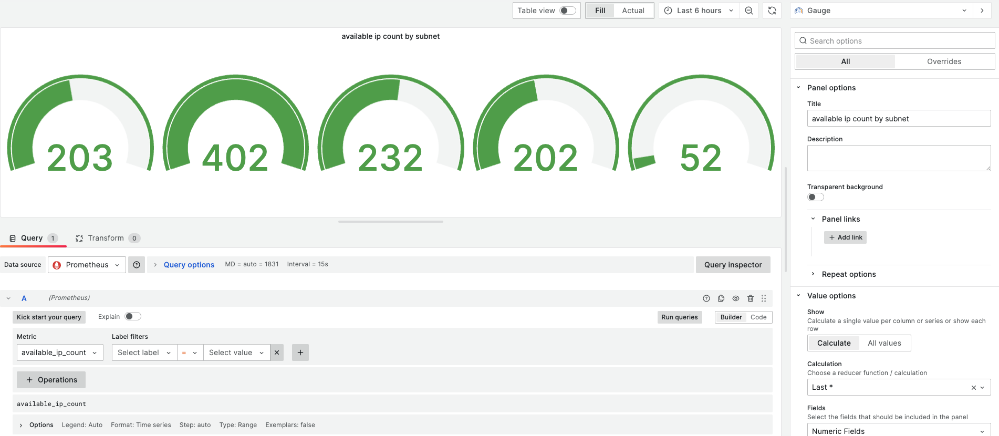

# aws-subnet-available-ip-collector

Collect number of available IPs per aws subnet and Send collected metrics to Pushgateway

## TODO
- Support helm chart install
- ~~collect ips from all subnet if user not set `filter.tags`~~
- Support Multi VPC?
- configure AWS credentials more safely

## Install
- Clone git
```shell
git clone 
https://github.com/GeunjeLEE/aws-subnet-available-ip-collector.git
```

- Move to directory
```shell
cd aws-subnet-avilable-ip-collector
```

- Config collector
```shell
vim kubernetes/configmap.yaml
```
| configure | description | default | etc |
| :---:   | :---: | :---: | :---: |
| credentials.aws_access_key_id | aws_access_key_id  | - | Need AmazonVPCReadOnlyAccess policy<br>Need to encrypt with base64 |
| credentials.aws_secret_access_key | aws_secret_access_key | - | Need AmazonVPCReadOnlyAccess policy<br>Need to encrypt with base64 |
| credentials.aws_region_name | AWS Region | ap-northeast-2 | |
| push_gateway_endpoint | Endpoint of prometheus-pushgateway | localhost:0901 | - |
| filters.vpc_id | `vpc_id` of collecting target subnet | - | |
| filters.tags | tag to subnet filtering | - | |
```yaml
apiVersion: v1
kind: ConfigMap
metadata:
  name: aws-subnet-available-ip-collector-conf
data:
  config.yaml: |
    credentials:
      aws_access_key_id: base64(<AWS_ACCESS_KEY_ID>
      aws_secret_access_key: base64(<AWS_SECRET_ACCESS_KEY>)
      #aws_region_name: <AWS_REGION_NAME> # default is ap-northeast-2
    push_gateway_endpoint: localhost:9091
    filters:
      vpc_id: <vpc_id>
      tags:
        key: value
```

- Deploy kubernetes manifests
```shell
kubectl apply -f kubernetes/configmap.yaml
kubectl apply -f kubernetes/deployment.yaml
```

## Set Grafana dashboard
Create panel and just Set the metric name to `available_ip_count`
 


## Delete
```shell
kubectl delete -f kubernetes/configmap.yaml
kubectl delete -f kubernetes/deployment.yaml
```


